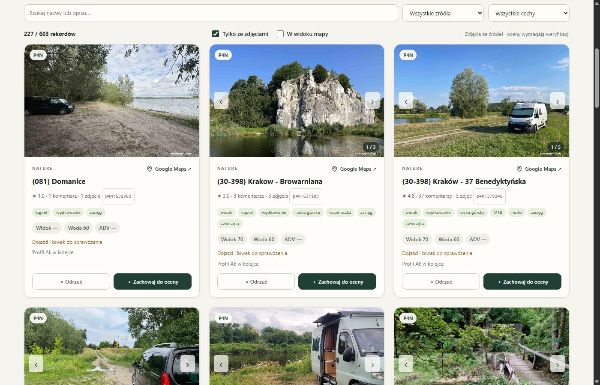
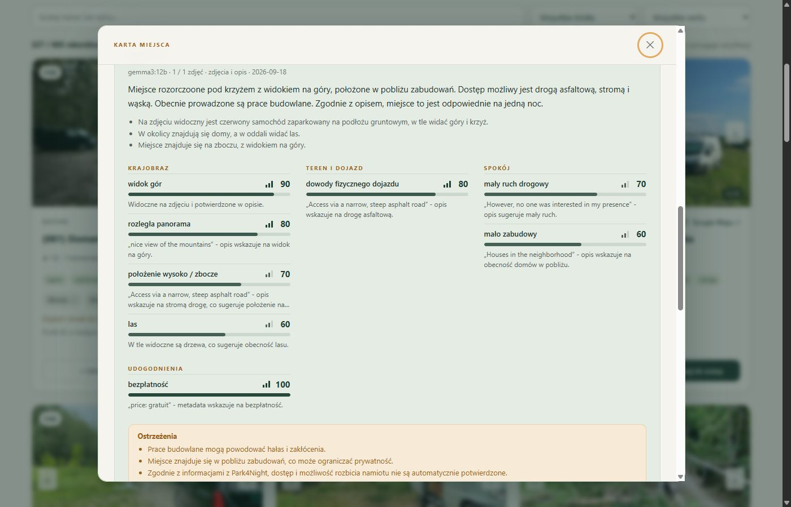
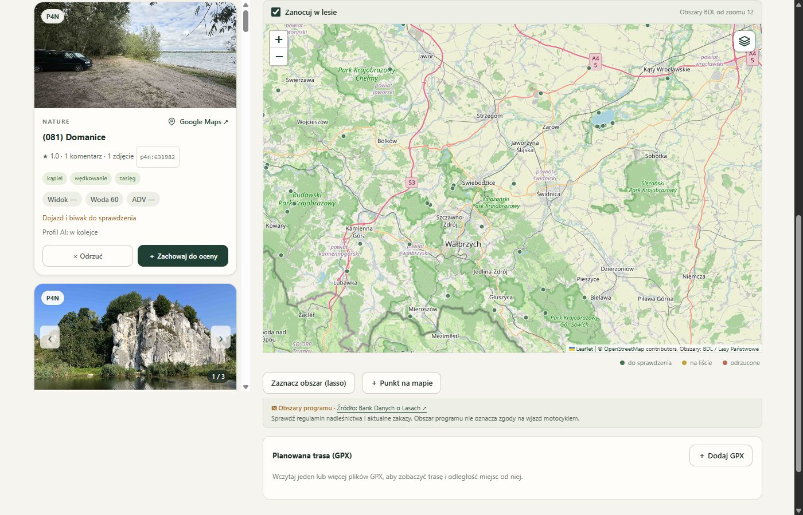

# Prześwit

*[Wersja polska](README.pl.md)*

A local-first, private library of wild-camping spots for ADV motorcycle trips: import places (JSON / GeoJSON / CSV / GPX / ZIP, P4N, OSM, BDL forest areas), add your own points with photos, browse them as a photo gallery or on a map (OSM, satellite, satellite + terrain relief, Polish "Zanocuj w lesie" forest-camping areas), load GPX routes and see how far every place is from your route, keep / reject places (also in bulk with a lasso), take notes — and **profile every place with a local vision model (Ollama, gemma3)**, then search by a natural-language description. Everything runs on your own computer; nothing is sent to the cloud.

The UI is available in Polish and English (PL/EN switch in the header; AI-generated profile texts are Polish because the model is prompted in Polish).

## Screenshots

| Gallery | Place card with AI profile | Map + list |
|---|---|---|
|  |  |  |

## Requirements

- Python 3.10+ on Windows, macOS or Linux (start scripts for each; the server itself is plain FastAPI).
- [Ollama](https://ollama.com) with a vision model: `ollama pull gemma3:12b` (`gemma3:4b` works too, with lower quality). The app starts its own Ollama process on port 11435 using the models directory `~/.ollama/models` (override with `PRZESWIT_MODELS`). A GPU with ≥ 12 GB VRAM is recommended for the 12B model; CPU-only profiling is very slow.
- Internet only for downloading photos referenced by imports and for map tiles; already fetched data works offline.

## Quick start

1. Start the server with the script for your platform — each one creates `.venv`, installs `requirements.txt` and runs `python -m app`; environment variables are read from `data/przeswit.env` (template: `przeswit.env.example`):
   - **Windows**: double-click `START.cmd` (or `start.ps1` in PowerShell)
   - **macOS**: double-click `start.command` (or `./start.sh` in Terminal)
   - **Linux**: `./start.sh`
   - manually: `python -m venv .venv`, `.venv/bin/pip install -r requirements.txt`, `.venv/bin/python -m app`

   Without Ollama the app still starts (browsing, imports, notes work); AI profiles are computed once Ollama with `gemma3:12b` is installed and the app is restarted.
2. Open http://127.0.0.1:8765 (API docs at `/docs`).
3. On an empty database the app automatically imports the bundled starter set (`seed/places_pl.pack`, 1364 nature spots in Poland), so there is something to browse right away; AI profiles are computed in the background. Add more via "Importuj miejsca" (template: `examples/template.json`, demo data: `examples/demo.json`) or drop an export into `inbox/`.

Large cards show photos without opening details; arrows switch photos, a click opens the gallery. Reject / Keep are stored in SQLite (the card disappears, the scroll position stays), "Cofnij" undoes the last decision. Tabs: to review, kept, rejected, all. Rejecting never deletes data. Every place has a copyable id and a `#place=…` deep link. Re-importing keeps your notes. External photos need internet; they are never replaced by fake imagery.

Keyboard: `J`/`K` next/previous card, `S` keep, `X` reject, `Enter` open card, `M` map, `/` search, `D` dark/light theme, `?` reminder. Filter presets (built-in and your own) live in the filter bar. The app can be installed on a phone as a PWA (over HTTPS; static assets work offline, data needs a connection).

Database and notes: `data/scout.sqlite3`. Back up the whole `data/` directory after stopping the app (or use the backup button in the import dialog). Never publish the database or the photo cache with the code — `data/` is git-ignored. Rankings are hints derived from available data, not confirmation of legal access or permission to camp.

Logo: own SVG mark. Colours: forest #203f35, paper #f6f4ef, amber #e5aa61.

## Development

Dev dependencies: `pip install -r requirements-dev.txt`. Tests: `python -m unittest discover -s tests -t .` (or `pytest`) — API tests use `fastapi.testclient` and a temporary database; they touch neither `data/` nor Ollama. Style: `ruff check app tests && ruff format app tests`. The frontend is plain ES modules with no build step; `node --check app/static/js/*.js` validates syntax. CI (GitHub Actions) runs lint and tests on Ubuntu and Windows. AI profile quality is measured with `python tools/qa_profiles.py` (metrics, suspicion rules, a review sample) — run it before and after any prompt change. See [CONTRIBUTING.md](CONTRIBUTING.md).

Data sources and law: the app is for personal use. The `app/p4n/` module fetches public data of the P4N service for your own library — check the service's terms before running it, keep the request delays, and do not redistribute fetched data beyond personal use. OSM and BDL data carry their own licences (attribution on the map).

## P4N data: module and starter set

`python -m app.p4n <step>` — a resumable pipeline with state in `data/p4n/`: `scan` (grid of points every 0.35°, 50 km radius, Poland by default; `--bbox lat_min,lon_min,lat_max,lon_max`), `details` (amenities, prices, seasonality, photos from the legacy API), `comments` (full comments from place pages; `--country Poland` first), `ingest` (conversion and upsert into the database, key `p4n:<id>`), `seed` (writes `seed/places_pl.pack`), `all` (scan → details → comments → ingest), `status`. Delays of 1–2.4 s between requests; HTTP 403/429 stops the run without retries. Contact details of place owners are never stored.

**Starter set**: the repository ships `seed/places_pl.pack` — a packed, non-plaintext set of nature spots in Poland (1364 places, comments without author names, no contact data). On first start with an empty database the app imports it once (setting `seed_imported`); deleted places do not come back. The set is a snapshot as of the date in its label — refresh it with your own run (`python -m app.p4n all`).

## Project layout

```
app/                 Python package (backend)
  server.py          uvicorn entry point (127.0.0.1:8765)
  web.py             FastAPI app: middleware, error mapping, static files, worker lifecycle, seed import
  api.py             /api/* and /photos/* endpoints
  schemas.py         request models (Pydantic)
  security.py        session token, allowed Host/Origin, CSP headers, Cloudflare Access gate
  settings.py        loads data/przeswit.env
  storage.py         SQLite, backups, settings, migrations
  core.py            normalisation, area filters, ranking
  importers.py       JSON/GeoJSON/CSV/GPX/ZIP import and the inbox folder
  providers.py       public data connectors (OSM, BDL)
  public_web.py      P4N public map adapter (sampled)
  p4n/               resumable P4N pipeline (client, convert, dataset, pipeline, CLI)
  sync.py            area synchronisation jobs
  ai_runtime.py      app-owned Ollama process (127.0.0.1:11435), resource telemetry
  local_vision.py    local vision inference
  profiles.py        automatic place profiles, description search, card metrics
  photo_cache.py     local photo cache (data/photos)
  prompts/           model prompts
  static/            frontend (part of the package, no build step)
    js/main.js       entry point (ES modules): wiring and boot
    js/state.js      shared state; dom.js helpers; api.js fetch with token
    js/library.js    loading, filtering, sorting; cards.js gallery; detail.js place card
    js/map.js        Leaflet + basemaps + BDL layer; lasso.js bulk selection; routes.js GPX routes and trip plan
    js/own.js        own points with photos (EXIF GPS); exif.js; presets.js presets, shortcuts, theme, PWA
    js/ai.js         description search, profile queue, photo cache, database; jobs.js; transfer.js
seed/                starter data set (packed)
tools/               qa_profiles.py — profile quality report
examples/            template.json (import template), demo.json (demo data)
tests/               unittest suites (core, importers, profiles, photo cache, database, API, P4N)
docs/                model comparison, validation notes, screenshots
data/                database, backups, photo cache, logs, env file (git-ignored)
inbox/               watched export folder (git-ignored)
```

Browser paths: `/` (app), `/static/...`, `/examples/template.json`, `/photos/<hash>` (cached photos), `/api/...` (JSON), `/docs` (OpenAPI), `/sw.js` (service worker). Every POST requires the `X-ADV-Token` header (value from `/api/config`) and an Origin of this app; the server accepts only Host `127.0.0.1:8765` / `localhost:8765` (plus the configured public host).

## GPX routes and trip plan

In "Mapa + lista" mode load any number of GPX files (tracks with segments, routes, waypoints). Every place gets its distance to the nearest route (point → segment), the list sorts by it, and the "only within X km of the route" filter works in the gallery too. The "Plan jazdy" panel orders kept places (and own points marked "planned") by km from the route start, splits them into days (km/day) and exports a GPX with numbered waypoints plus the route track — for Garmin, OsmAnd and similar.

## Phone access (Cloudflare Tunnel + Access)

The app can be reachable under your own domain without opening ports: `cloudflared` on the computer keeps a tunnel to 127.0.0.1:8765 and Cloudflare Access lets in only the logged-in owner (Google / one-time e-mail code). Tunnel configuration and credentials live in `data/cloudflared/` (outside git). The server needs `PRZESWIT_PUBLIC_HOST` (e.g. `przeswit.example.com`) and `PRZESWIT_ACCESS_EMAILS` (comma-separated; template in `przeswit.env.example`, loaded from `data/przeswit.env`); requests on the public host without a `Cf-Access-Authenticated-User-Email` header matching one of those addresses get 403 — even if someone bypassed Access. Owners (`PRZESWIT_OWNER_EMAILS`) can write; other allowed addresses get a read-only mode (banner, hidden buttons, POST → 403). Every decision and note records its author (Access e-mail or `local`) and time. Optionally the server verifies the Access JWT signature (`PRZESWIT_ACCESS_TEAM`, `PRZESWIT_ACCESS_AUD`; team public keys refreshed hourly). Local access keeps working as before. Start manually: `START.cmd` / `scripts/run_app.cmd` (server) and `scripts/run_tunnel.cmd` or `scripts/run_tunnel.sh` (tunnel) — no autostart; logs in `data/app.log` and `data/cloudflared/tunnel.log`.

## Automatic profiles and description search

Every new or changed place gets a profile in the background, independent of the search prompt; changes are detected at start and every 15 s. The SQLite table `profiles` stores state, prompt version, a digest of the source data, errors and the result. A restart resumes interrupted records; errors get up to three automatic retries with back-off; the UI can retry them manually and pause the queue after the current place. Up to two analyses run in parallel depending on free VRAM/RAM.

The classification prompt is `app/prompts/profile_prompt.md` (v3). The catalogue has 37 features: landscape, water, surface, tent space, motorcycle, privacy, traffic, amenities, costs and risks. Each recognised feature has a score, a confidence, a reason and references to sources actually passed to the model (the response schema restricts evidence ids to those). Features derived from text must quote the source; the code verifies that the quote exists, drops unsupported observations and caps the confidence of unquoted ones. Up to 5 photos and 15 latest comments per record. No photos means a `text_only` profile, never a faked image analysis.

"Szukaj według opisu" runs a second prompt that translates your wish into features, target values, weights and hard requirements; the code then scores ALL ready profiles, weighting by confidence — unknown features do not satisfy requirements. The interpretation is shown in the UI, unsupported requirements are surfaced. Results are a snapshot of ready profiles; search again to include profiles finished later. Profiling never changes your kept/rejected decisions.

Card metrics ADV / View / Water / Quiet come from rules (geo, keywords) and, when a profile is ready, from its features (best-documented feature with confidence ≥ 40 %, ≥ 60 % for text-only profiles; negative features such as mud or barriers lower ADV). Profile values complement the rules rather than overwrite them; a saved cloud analysis takes precedence. Cards show an "AI" tag, the place card shows the mode and the reasoning for every metric.

Inference happens only through the local Ollama process (127.0.0.1:11435); no paid APIs. Judgements are subjective; the model does not confirm legality or road access. Photos and descriptions never get tool-execution rights.

## Durable database and concurrency

Database: `data/scout.sqlite3`, SQLite WAL, `synchronous=FULL`, `busy_timeout=20 s`. Places, decisions, notes, profiles and queue state survive restarts. The path can be changed with `PRZESWIT_DATA`. Online backups use the SQLite Backup API, then `quick_check` and an atomic rename; one backup per day lands in `data/backups/`, extra ones via the button in the import dialog. Backups are never deleted automatically and live on the same disk — copy them elsewhere for real safety. Restore only after stopping the app.

The app-owned Ollama process runs on 127.0.0.1:11435 with `OLLAMA_NUM_PARALLEL=2` and one loaded model; cloud features and automatic model pruning are disabled for it. A regular Ollama on 11434 stays a separate service. Job claims use `BEGIN IMMEDIATE` and a durable `running` status; source and version changes prevent an older answer from overwriting a newer profile. The parallelism control is Auto / 1 / 2: Auto grants two jobs on a ≥ 18 GB GPU with ≥ 3 GB free VRAM, one below that, and pauses new jobs below 1.5 GB VRAM or 4 GB free RAM. Search takes precedence over starting new profiles.

## Local photo cache

Images from known direct CDN addresses are stored in `data/photos` under the SHA-256 of the URL; metadata and errors in the `photo_cache` table. Only addresses already present in imported records are fetched — the app never crawls services for extra photos. Background prefetch is parallel (6 threads by default, `PRZESWIT_PHOTO_PARALLEL` 1–10, request starts spaced 0.25 s, the same URL never fetched twice at once) and shares the cache with profiling. Limits: 50 GiB total, 6 MB per photo, 2 GiB free-disk reserve. A 401/403/429 defers the whole source for 24 h; single-photo errors are deferred 24 h. Own photos uploaded through the UI are stored the same way under `own://<sha256>` addresses. The gallery and the model use the same file, served at `/photos/<hash>` without CDN redirects. SQLite backups cover photo metadata, not the files — keep `data/photos` for a full offline copy.

## Licence

MIT — see `LICENSE`. Leaflet (`app/static/vendor/`) is BSD-2 (`app/static/vendor/LICENSE`).
